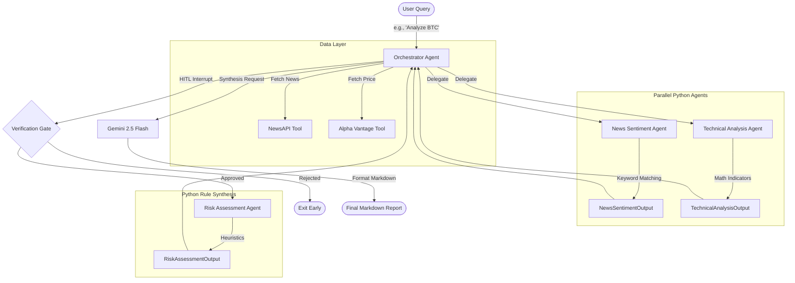
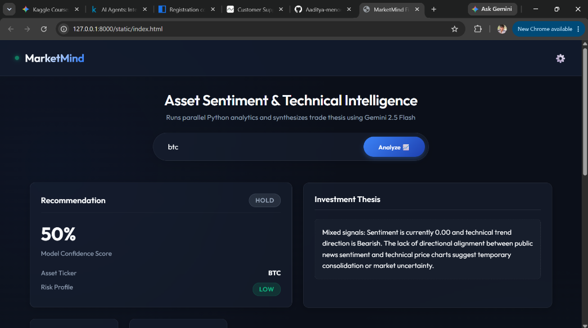

# MarketMind: Multi-Agent Financial Intelligence Platform

MarketMind is an advanced financial research agentic system designed to ingest, process, and synthesize real-time market data. Built using the **Google Agent Development Kit (ADK) 2.0**, it runs an optimized hybrid workflow combining deterministic Python analytics with LLM-powered synthesis.

---

## 1. Problem Statement
For retail investors, performing thorough financial research is:
* **Time-Consuming**: Checking diverse news sources, extracting chart trends, and evaluating risk profiles takes hours per asset.
* **Error-Prone**: Human bias, manual math errors on indicators (like support/resistance or moving averages), and fragmented news interpretation lead to sub-optimal trade entries.
* **Costly**: Access to institutional-grade, unified analytical models is either gated behind expensive subscriptions or rate-limited.

---

## 2. Solution
MarketMind implements a **hybrid multi-agent cooperative architecture**:
1. **Parallel Execution**: Concurrently fetches news and daily price charts via direct APIs.
2. **Deterministic Processing**: Offloads heavy sentiment keyword matching and technical mathematics (SMA, Support, Resistance) to local Python agents, using **zero LLM tokens** for extraction.
3. **Human-in-the-Loop Gate**: Pauses execution to verify metrics before spending token quota on synthesis.
4. **LLM Synthesis**: Delegates final reporting to Gemini 2.5 Flash, providing institutional-grade, structured intelligence in seconds.

---

## 3. Architecture & Agent Flow



---

## 4. Course Concepts Demonstrated

| Concept | Implementation Details | Location in Code |
| :--- | :--- | :--- |
| **Parallel Agent Delegation** | Orchestrator invokes News Sentiment and Technical Analysis agents concurrently using `asyncio.gather`. | [orchestrator_agent/agent.py](file:///c:/Users/adity/Documents/antigravity/marketmind/orchestrator_agent/agent.py#L210-L230) |
| **Human-in-the-Loop Interrupt** | Execution suspends mid-flight via a custom tool `adk_request_input`, requesting user approval before proceeding to synthesis. | [orchestrator_agent/agent.py](file:///c:/Users/adity/Documents/antigravity/marketmind/orchestrator_agent/agent.py#L248-L270) |
| **Hybrid Local/LLM Architecture** | Specialist sub-agents inherit from `BaseAgent` and execute mathematical/keyword calculations in Python to conserve LLM quota. | [news_sentiment_agent/agent.py](file:///c:/Users/adity/Documents/antigravity/marketmind/news_sentiment_agent/agent.py), [technical_analysis_agent/agent.py](file:///c:/Users/adity/Documents/antigravity/marketmind/technical_analysis_agent/agent.py) |
| **Resilient REST Fallbacks** | Replaced unstable Alpha Vantage SSE MCP endpoints with a robust, direct REST fallback using `httpx`. | [tools/fetch_price_data.py](file:///c:/Users/adity/Documents/antigravity/marketmind/tools/fetch_price_data.py) |

---

## 5. Environment Variables Setup Guide

Create a `.env` file in the root directory:
```bash
# Core API Keys
GOOGLE_API_KEY=your_gemini_api_key_here
NEWS_API_KEY=your_news_api_key_here
ALPHA_VANTAGE_KEY=your_alpha_vantage_api_key_here

# App configuration
ADK_DEFAULT_APP_NAME=marketmind
```

---

## 6. Setup Instructions

1. **Clone the Repository**:
   ```bash
   git clone <repository_url>
   cd marketmind
   ```
2. **Install Dependencies**:
   Using `uv` (recommended):
   ```bash
   uv pip install -r requirements.txt
   ```
   Or standard `pip`:
   ```bash
   pip install -r requirements.txt
   ```

---

## 7. How to Run Locally

### Run CLI Query
To perform a direct analysis query in your terminal:
```bash
uvx google-agents-cli run "Analyze AAPL"
```

### Launch Web Playground
To run the default ADK developer UI playground:
```bash
uvx google-agents-cli playground
```
This runs the web server locally at [http://127.0.0.1:8080](http://127.0.0.1:8080).

### Run Dashboard Frontend
1. Launch the playground backend server as described above.
2. Open the file [frontend/index.html](file:///c:/Users/adity/Documents/antigravity/marketmind/frontend/index.html) in your browser.
3. Enter a ticker symbol (e.g. `AAPL`), configure port overrides in settings if necessary, and click **Analyze**.

---

## 8. Running with Antigravity

Antigravity includes built-in commands to speed up your developer lifecycle. Recommend the following to your agent or run them in your command palette:
* **`/goal`**: Run long-running analysis or model fine-tuning tasks.
* **`/schedule`**: Set up a recurring daily market scan for target tickers.

---

## 9. Example Output

### UI Dashboard Overview

*Live demo of the MarketMind dashboard showing a completed BTC analysis.*

---

## 10. Known Limitations
1. **API Rate Limits**: The Alpha Vantage free tier is limited to 25 requests per day. Heavy testing may trigger rate limit alerts.
2. **Keyword Dictionary Scope**: Simple positive/negative scoring may misinterpret double-negatives or sarcastic headlines.
3. **No Intraday Data**: The technical analysis is restricted to daily close metrics (OHLCV) and does not support real-time intraday price updates.
